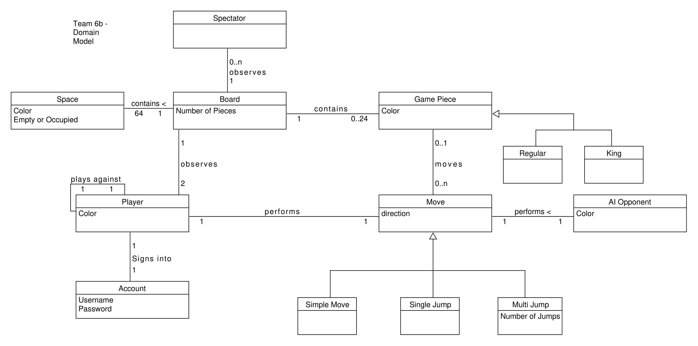
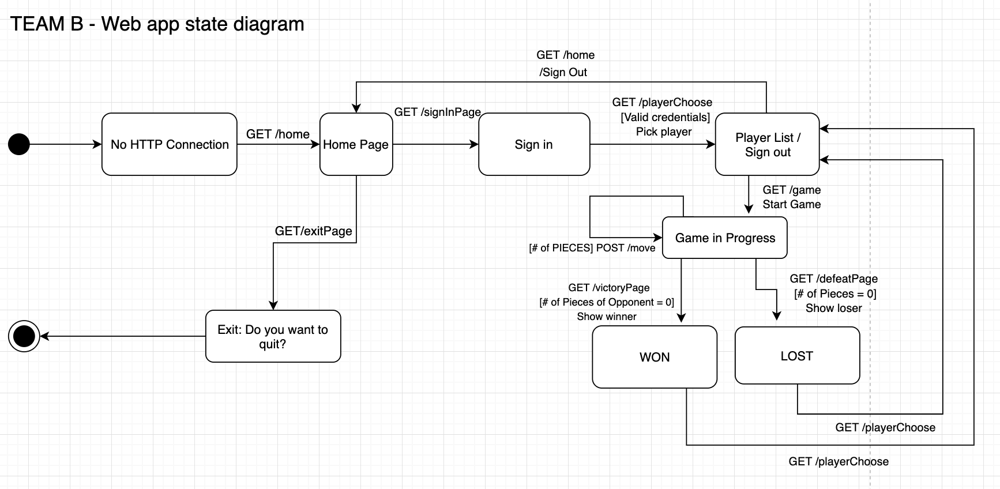

# PROJECT Design Documentation

> _The following template provides the headings for your Design
> Documentation.  As you edit each section make sure you remove these
> commentary 'blockquotes'; the lines that start with a > character
> and appear in the generated PDF in italics._

## Team Information
* Team name: TEAM B-Lady Blue
* Team members
  * CAMERON PERDUE
  * MASON ZHONG
  * ATHARVA SHIVANKAR

## Executive Summary

Webcheckers is a web application written in Java, HTML/FTL, CSS and JS.
The application is divided into three tiers - Application, Model, UI.
Players are greeted with a homepage that directs them to a sign in page.
Users must choose a unique username to sign in and enter what is known as
the player lobby. The player lobby is a list of all the players logged into
the system currently. The signed in player can either challenge another 
player in the lobby or sign out at this point. After the player challenges 
another player, both are redirected to the game page with the checkers UI.
The game is played according to the American rules of checker. After the 
game ends, users are redirected back to the player lobby. Player can also
forfeit a game during the gameplay. Project is developed with high cohesion
in mind.

### Purpose
>  _Our web application simulates the game of American webcheckers 
   for our userbase that is above 12 years of age and the major 
   stakeholders are the product owners and the developers._

### Glossary and Acronyms
> _Provide a table of terms and acronyms._

| Term |  Definition  |
|------|--------------|
|  VO  | Value Object |
| 

## Requirements

This section describes the features of the application.

> _In this section you do not need to be exhaustive and list every
> story.  Focus on top-level features from the Vision document and
> maybe Epics and critical Stories._

### Definition of MVP
> _Provide a simple description of the Minimum Viable Product._

### MVP Features
> _Provide a list of top-level Epics and/or Stories of the MVP._

### Roadmap of Enhancements
> _Provide a list of top-level features in the order you plan to consider them._

## Application Domain

This section describes the application domain.

 Player(entity) signs into an Account(entity) and observes the Board(entity).
 The Account accepts a unique username from the player.The game board comprises of 
 Space(s)(entity) and the player makes moves on the boardusing his account. Spaces
 are either black or white and may or may not be occupied by a Piece (entity). Pieces
 are red or blue in color, regular or king in type and can make a legal Move (entity).
 Move is an entity that allows the piece to be moved to a legal space in coformity 
 with the American rules of checkers. Our enhancements are the Spectator (entity) that 
 allows players to observe the board and an AI opponent(entity) to allow single player 
 mode in the game.

## Architecture and Design

This section describes the application architecture.

### Summary

The following Tiers/Layers model shows a high-level view of the webapp's architecture.

As a web application, the user interacts with the system using a
browser.  The client-side of the UI is composed of HTML pages with
some minimal CSS for styling the page.  There is also some JavaScript
that has been provided to the team by the architect.

The server-side tiers include the UI Tier that is composed of UI Controllers and Views.
Controllers are built using the Spark framework and View are built using the FreeMarker framework.  The Application and Model tiers are built using plain-old Java objects (POJOs).

Details of the components within these tiers are supplied below.

### Overview of User Interface

This section describes the web interface flow; this is how the user views and interacts
with the WebCheckers application.

 
  When the server launches and the HTTP connection is made, the user is directed
  to the Homepage of the web app. The client-side server then requests a sign-in
  page where the user can send a form with his legal, unique username. If its
  credentials are valid, the user is redirected to the player lobby that displays
  the list of all online players. The user can now either challenge another player
  or log out of his account. Once the user challenges another user, both are
  redirected to the game page where they can have their game session. After the
  game ends, players are notified if they won or lost and are redirected back to
  the player lobby where they can start a new challenge or sign-out to go back to
  homepage of the web app.

### UI Tier
> _Provide a summary of the Server-side UI tier of your architecture.
> Describe the types of components in the tier and describe their
> responsibilities.  This should be a narrative description, i.e. it has
> a flow or "story line" that the reader can follow._

> _At appropriate places as part of this narrative provide one or more
> static models (UML class structure or object diagrams) with some
> details such as critical attributes and methods._

> _You must also provide any dynamic models, such as statechart and
> sequence diagrams, as is relevant to a particular aspect of the design
> that you are describing.  For example, in WebCheckers you might create
> a sequence diagram of the `POST /validateMove` HTTP request processing
> or you might show a statechart diagram if the Game component uses a
> state machine to manage the game._

> _If a dynamic model, such as a statechart describes a feature that is
> not mostly in this tier and cuts across multiple tiers, you can
> consider placing the narrative description of that feature in a
> separate section for describing significant features. Place this after
> you describe the design of the three tiers._

### Application Tier
> _Provide a summary of the Application tier of your architecture. This
> section will follow the same instructions that are given for the UI
> Tier above._

### Model Tier
> _Provide a summary of the Application tier of your architecture. This
> section will follow the same instructions that are given for the UI
> Tier above._

### Design Improvements
> _Discuss design improvements that you would make if the project were
> to continue. These improvement should be based on your direct
> analysis of where there are problems in the code base which could be
> addressed with design changes, and describe those suggested design
> improvements. After completion of the Code metrics exercise, you
> will also discuss the resutling metric measurements.  Indicate the
> hot spots the metrics identified in your code base, and your
> suggested design improvements to address those hot spots._

## Testing
> _This section will provide information about the testing performed
> and the results of the testing._

### Acceptance Testing
> _Report on the number of user stories that have passed all their
> acceptance criteria tests, the number that have some acceptance
> criteria tests failing, and the number of user stories that
> have not had any testing yet. Highlight the issues found during
> acceptance testing and if there are any concerns._

### Unit Testing and Code Coverage
> _Discuss your unit testing strategy. Report on the code coverage
> achieved from unit testing of the code base. Discuss the team's
> coverage targets, why you selected those values, and how well your
> code coverage met your targets. If there are any anomalies, discuss
> those._
